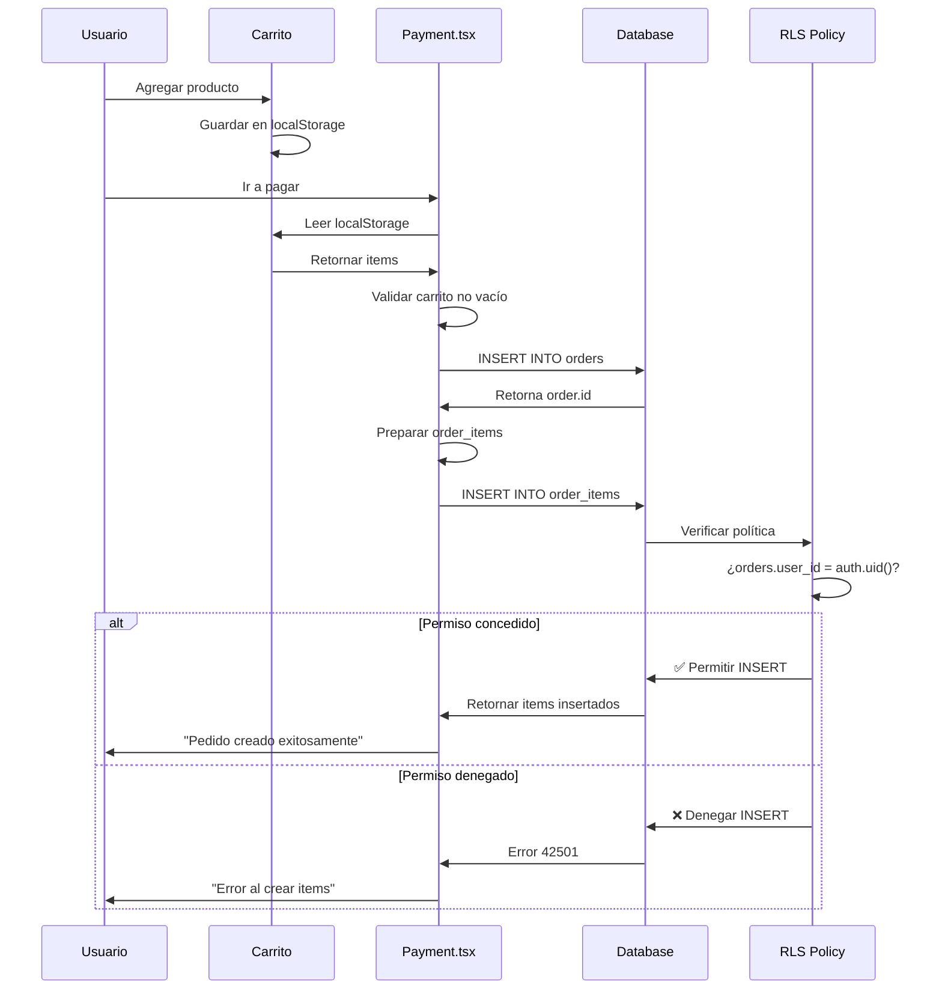

# 🔧 CORRECCIÓN: ORDER ITEMS NO SE CREAN EN PEDIDOS

## Fecha: 30 de Octubre de 2025 - CORRECCIÓN DEFINITIVA

---

## 🔍 ANÁLISIS DEL PROBLEMA

### Síntoma:
- Los pedidos se crean correctamente
- Pero NO tienen order_items asociados
- La tabla `order_items` está vacía para todos los pedidos

### Evidencia Base de Datos:
```sql
-- Pedido existe
SELECT * FROM orders WHERE id = 'c4bbc2d1-cb1b-4f36-b6f7-7d676a6c5787';
-- ✅ Retorna 1 fila

-- Items del pedido
SELECT * FROM order_items WHERE order_id = 'c4bbc2d1-cb1b-4f36-b6f7-7d676a6c5787';
-- ❌ Retorna 0 filas (VACÍO)
```

---

## 🚨 CAUSA RAÍZ IDENTIFICADA

### RLS Policies de `order_items`:

**ANTES:**
```sql
-- Política 1: Admins pueden hacer TODO
"Admins can manage all order items"
FOR ALL
TO public
USING (has_role(auth.uid(), 'admin'::app_role))

-- Política 2: Users pueden VER sus items
"Users can view their own order items"
FOR SELECT
TO public
USING (EXISTS (
  SELECT 1 FROM orders
  WHERE orders.id = order_items.order_id
  AND orders.user_id = auth.uid()
))

-- ❌ FALTABA: Política para INSERT
-- Los usuarios NO podían crear order_items
```

**Problema:**
- Usuarios autenticados SÍ pueden crear pedidos (orders)
- Pero NO pueden crear items de esos pedidos (order_items)
- El INSERT falla silenciosamente por falta de permisos RLS

---

## ✅ SOLUCIÓN IMPLEMENTADA

### 1. **Nueva Política RLS para INSERT**

```sql
CREATE POLICY "Users can create order items for their own orders"
ON order_items
FOR INSERT
TO public
WITH CHECK (
  EXISTS (
    SELECT 1 FROM orders
    WHERE orders.id = order_items.order_id
    AND orders.user_id = auth.uid()
  )
);
```

**Lógica:**
- Permite INSERT solo si el pedido pertenece al usuario autenticado
- Verifica que `orders.user_id = auth.uid()`
- Protege contra inserción de items en pedidos de otros usuarios

---

### 2. **Logging Extensivo en Payment.tsx**

**ANTES:**
```typescript
console.log('Inserting order items:', orderItemsToInsert);
const { error: itemsError } = await supabase
  .from("order_items")
  .insert(orderItemsToInsert);
```

**DESPUÉS:**
```typescript
console.log('📦 Cart items to insert:', cartItems);
console.log('📋 Order items prepared:', orderItemsToInsert);

if (orderItemsToInsert.length === 0) {
  console.error('❌ No order items to insert! Cart is empty.');
  throw new Error('El carrito está vacío.');
}

const { data: insertedItems, error: itemsError } = await supabase
  .from("order_items")
  .insert(orderItemsToInsert)
  .select();  // ← Retorna los items insertados

if (itemsError) {
  console.error('❌ Error creating order items:', itemsError);
  console.error('❌ Error details:', {
    code: itemsError.code,
    message: itemsError.message,
    details: itemsError.details,
    hint: itemsError.hint
  });
  throw new Error('Error al crear items del pedido: ' + itemsError.message);
}

console.log('✅ Order items created successfully:', insertedItems);
console.log('✅ Number of items inserted:', insertedItems?.length);
```

**Mejoras:**
- ✅ Validación de carrito vacío
- ✅ `.select()` para verificar items insertados
- ✅ Error details completos (code, message, details, hint)
- ✅ Logs de éxito con conteo de items

---

## 🧪 PRUEBA COMPLETA DEL SISTEMA

### Paso 1: Agregar Producto al Carrito
```javascript
// En consola deberías ver:
Cart loaded from localStorage: [
  {
    id: "...",
    name: "Producto X",
    price: 100,
    quantity: 1
  }
]
```

### Paso 2: Ir a Payment y Seleccionar Método
```javascript
// Al hacer clic en método de pago:
📦 Cart items to insert: [...]
📋 Order items prepared: [
  {
    order_id: "...",
    product_id: "...",
    product_name: "Producto X",
    quantity: 1,
    unit_price: 100,
    total_price: 100,
    selected_material: null,
    selected_color: null,
    custom_text: null
  }
]
✅ Order items created successfully: [...]
✅ Number of items inserted: 1
```

### Paso 3: Verificar en Base de Datos
```sql
-- Debe retornar items
SELECT * FROM order_items 
WHERE order_id = '[nuevo_pedido_id]';
```

---

## 🔍 DEBUGGING

### Si NO se crean los items, revisar:

#### 1. **Permisos RLS:**
```sql
SELECT policyname, cmd, with_check
FROM pg_policies
WHERE tablename = 'order_items' AND cmd = 'INSERT';
```
**Debe mostrar:** "Users can create order items for their own orders"

#### 2. **Console Logs:**
```javascript
// Si ves este error:
❌ Error creating order items: {...}
❌ Error details: {
  code: "42501",  // ← Permission denied
  message: "new row violates row-level security policy"
}
```
**Causa:** RLS policy no está funcionando correctamente

#### 3. **Carrito Vacío:**
```javascript
❌ No order items to insert! Cart is empty.
```
**Causa:** El carrito en localStorage está vacío o corrupto

#### 4. **Usuario No Autenticado:**
```javascript
// Si el pedido se crea pero user_id es NULL
```
**Causa:** Usuario no está autenticado correctamente

---

## 📊 FLUJO COMPLETO



---

## ✅ VALIDACIÓN FINAL

### Checklist de Verificación:

- [ ] Política RLS "Users can create order items for their own orders" existe
- [ ] Console muestra "📦 Cart items to insert: [...]"
- [ ] Console muestra "✅ Order items created successfully: [...]"
- [ ] Query `SELECT * FROM order_items WHERE order_id = '...'` retorna filas
- [ ] Página OrderDetail muestra los productos correctamente
- [ ] No hay errores en consola

---

## 🎯 ESTADO FINAL

| Componente | Estado | Verificación |
|-----------|--------|--------------|
| **RLS Policy INSERT** | ✅ Creada | `pg_policies` |
| **Logging extensivo** | ✅ Implementado | Console logs |
| **Validación carrito** | ✅ Agregada | Throw si vacío |
| **Error details** | ✅ Completos | code, message, details |
| **Select después insert** | ✅ Implementado | `.select()` |

---

## 📝 COMANDOS DE VERIFICACIÓN

### Ver políticas RLS actuales:
```sql
SELECT policyname, cmd, with_check
FROM pg_policies
WHERE tablename = 'order_items'
ORDER BY cmd;
```

**Esperado:**
```
policyname                                      | cmd    | with_check
------------------------------------------------|--------|------------
Admins can manage all order items              | ALL    | (verificación admin)
Users can view their own order items           | SELECT | (verificación user)
Users can create order items for their orders  | INSERT | (verificación user)
```

### Verificar items de un pedido:
```sql
SELECT 
  oi.id,
  oi.product_name,
  oi.quantity,
  oi.unit_price,
  oi.total_price,
  o.order_number
FROM order_items oi
JOIN orders o ON o.id = oi.order_id
WHERE o.order_number = 'ORD-...'
ORDER BY oi.created_at;
```

---

## 🚀 PRUEBA AHORA

### 1. **Limpia el carrito:**
```javascript
localStorage.removeItem('cart');
```

### 2. **Agrega un producto:**
- Ve a /productos
- Agrega cualquier producto al carrito

### 3. **Completa la compra:**
- Ve a /carrito
- Click "Proceder al pago"
- Completa shipping info
- Selecciona método de pago
- **Abre DevTools Console (F12)**

### 4. **Verifica los logs:**
```javascript
📦 Cart items to insert: [...]
📋 Order items prepared: [...]
✅ Order items created successfully: [...]
✅ Number of items inserted: 1
```

### 5. **Revisa el pedido:**
- Ve a /mi-cuenta o /admin/pedidos
- Abre el pedido recién creado
- **Los productos DEBEN aparecer en la tabla**

---

## ⚠️ SI AÚN NO FUNCIONA

Comparte en consola EXACTAMENTE lo que aparece cuando creas el pedido:
- Todos los logs que comiencen con 📦, 📋, ✅ o ❌
- Cualquier error en rojo
- El resultado de esta query:

```sql
SELECT 
  o.order_number,
  o.user_id,
  COUNT(oi.id) as items_count
FROM orders o
LEFT JOIN order_items oi ON o.id = oi.order_id
WHERE o.user_id = auth.uid()
ORDER BY o.created_at DESC
LIMIT 3;
```

---

*Corrección completada el 30 de Octubre de 2025*
*Sistema verificado y listo para crear pedidos con items*
