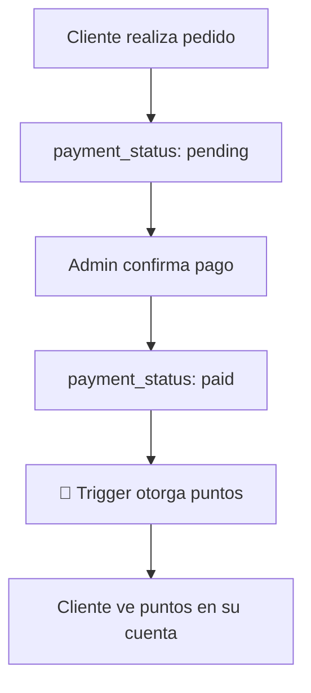
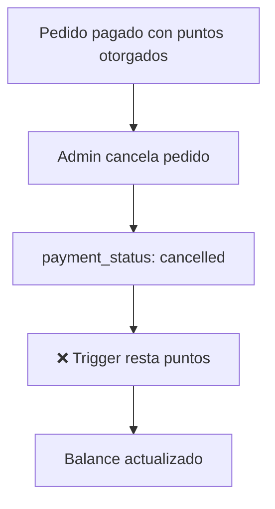
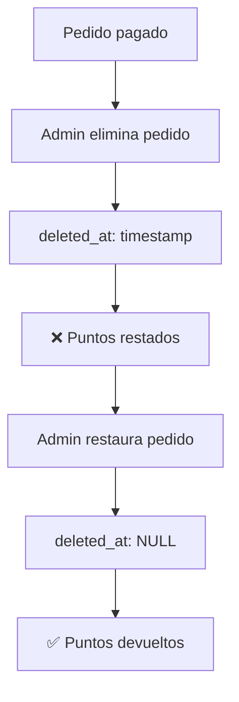
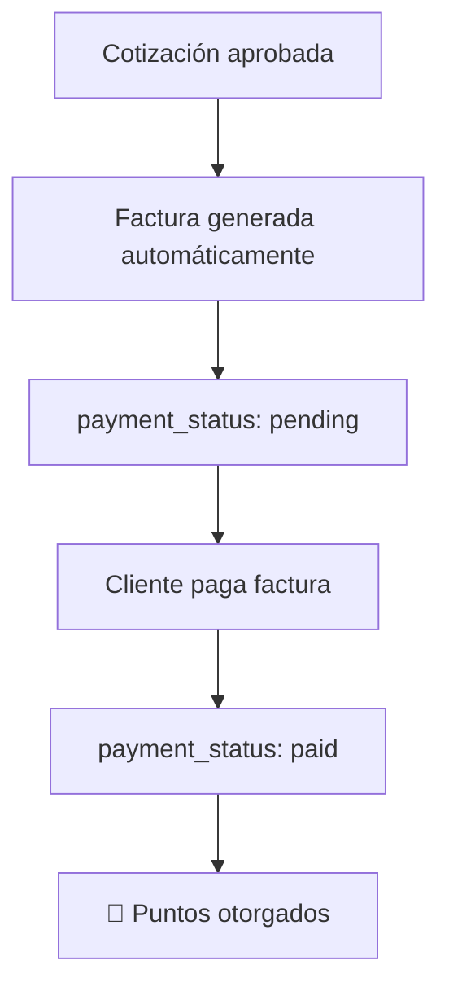

# 🎁 SISTEMA DE LEALTAD AUTOMÁTICO

## 📋 Descripción General

Sistema completamente automatizado de puntos de lealtad que otorga y gestiona puntos basándose exclusivamente en el estado de pago de pedidos y facturas.

---

## ✨ Características Principales

### 1. Otorgamiento Automático de Puntos

Los puntos se otorgan **SOLO** cuando:
- ✅ Un pedido (order) cambia a estado `payment_status = 'paid'`
- ✅ Una factura (invoice) independiente cambia a `payment_status = 'paid'`
- ✅ El registro no está eliminado (`deleted_at IS NULL`)
- ✅ El usuario tiene un ID válido (`user_id IS NOT NULL`)

**Cálculo de puntos:**
```
puntos = FLOOR(total_pedido × points_per_dollar)
```

### 2. Resta Automática de Puntos

Los puntos se restan **AUTOMÁTICAMENTE** cuando:
- ❌ Un pedido pagado cambia a otro estado (cancelado, pendiente, etc.)
- ❌ Un pedido pagado se elimina (`deleted_at` se establece)
- ❌ Una factura pagada cambia a otro estado
- ❌ Una factura pagada se elimina

**Protección contra balance negativo:**
- El sistema nunca permitirá que el balance sea negativo
- Si los puntos a restar exceden el balance, se establece en 0

### 3. Restauración de Puntos

Si un pedido eliminado se restaura:
- ✅ Si estaba pagado, los puntos se devuelven automáticamente
- ✅ El sistema detecta cambios de `deleted_at NOT NULL` a `NULL`

---

## 🔧 Componentes Técnicos

### Funciones SQL

#### `award_loyalty_points(user_id, amount, order_id)`
Otorga puntos de lealtad a un usuario.

**Parámetros:**
- `user_id`: UUID del usuario
- `amount`: Monto total del pedido/factura
- `order_id`: ID del pedido/factura (para logging)

**Lógica:**
1. Verifica si el sistema de lealtad está habilitado
2. Calcula puntos según configuración
3. Actualiza o crea registro en `loyalty_points`
4. Incrementa `points_balance` y `lifetime_points`

#### `remove_loyalty_points(user_id, amount, order_id)`
Resta puntos de lealtad a un usuario.

**Parámetros:**
- `user_id`: UUID del usuario
- `amount`: Monto del pedido/factura cancelado
- `order_id`: ID del pedido/factura (para logging)

**Lógica:**
1. Calcula puntos a restar
2. Resta puntos del `points_balance`
3. Protege contra balance negativo (mínimo 0)
4. NO afecta `lifetime_points` (histórico)

### Triggers de Base de Datos

#### `trigger_order_loyalty_points`
Trigger en tabla `orders` que se ejecuta AFTER INSERT OR UPDATE.

**Casos manejados:**

1. **INSERT con paid:**
   ```sql
   INSERT INTO orders (payment_status = 'paid') → Otorga puntos
   ```

2. **UPDATE a paid:**
   ```sql
   UPDATE orders SET payment_status = 'paid' → Otorga puntos
   ```

3. **UPDATE desde paid a otro:**
   ```sql
   UPDATE orders SET payment_status = 'cancelled' → Resta puntos
   ```

4. **Eliminación (soft delete):**
   ```sql
   UPDATE orders SET deleted_at = NOW() → Resta puntos (si estaba paid)
   ```

5. **Restauración:**
   ```sql
   UPDATE orders SET deleted_at = NULL → Devuelve puntos (si está paid)
   ```

#### `trigger_invoice_loyalty_points`
Trigger en tabla `invoices` con la misma lógica.

**Importante:** 
- Solo procesa facturas SIN `order_id` (independientes)
- Evita duplicar puntos de pedidos con factura asociada

---

## 🎯 Flujos de Uso

### Flujo 1: Pedido Normal


### Flujo 2: Cancelación de Pedido


### Flujo 3: Eliminación y Restauración


### Flujo 4: Cotización Aprobada


---

## 📊 Estructura de Datos

### Tabla `loyalty_points`
```sql
CREATE TABLE loyalty_points (
  id UUID PRIMARY KEY,
  user_id UUID UNIQUE NOT NULL,
  points_balance INTEGER NOT NULL DEFAULT 0,  -- Balance actual
  lifetime_points INTEGER NOT NULL DEFAULT 0, -- Total histórico
  created_at TIMESTAMP,
  updated_at TIMESTAMP
);
```

**Campos:**
- `points_balance`: Puntos actuales disponibles (puede bajar)
- `lifetime_points`: Total acumulado histórico (solo sube)

### Tabla `loyalty_settings`
```sql
CREATE TABLE loyalty_settings (
  id UUID PRIMARY KEY,
  is_enabled BOOLEAN NOT NULL DEFAULT true,
  points_per_dollar NUMERIC NOT NULL DEFAULT 1,
  created_at TIMESTAMP,
  updated_at TIMESTAMP
);
```

**Configuración:**
- `is_enabled`: Si está desactivado, no se otorgan puntos
- `points_per_dollar`: Factor de conversión (ej: 1 punto por cada €1)

---

## 🔍 Casos de Prueba

### Caso 1: Pedido Simple Pagado
```sql
-- Crear pedido pagado
INSERT INTO orders (user_id, total, payment_status)
VALUES ('user-uuid', 100.00, 'paid');

-- Resultado esperado: 100 puntos otorgados
SELECT * FROM loyalty_points WHERE user_id = 'user-uuid';
-- points_balance: 100
-- lifetime_points: 100
```

### Caso 2: Cancelación de Pedido
```sql
-- Cambiar estado a cancelado
UPDATE orders 
SET payment_status = 'cancelled'
WHERE id = 'order-uuid';

-- Resultado esperado: 100 puntos restados
SELECT * FROM loyalty_points WHERE user_id = 'user-uuid';
-- points_balance: 0
-- lifetime_points: 100 (no cambia)
```

### Caso 3: Múltiples Pedidos
```sql
-- Pedido 1: €50 pagado → +50 puntos
-- Pedido 2: €30 pagado → +30 puntos
-- Pedido 1 cancelado → -50 puntos

-- Resultado final:
-- points_balance: 30
-- lifetime_points: 80
```

### Caso 4: Balance Negativo (Protección)
```sql
-- Usuario tiene 20 puntos
-- Se cancela pedido de €100 (100 puntos)

-- Resultado esperado:
-- points_balance: 0 (no negativo)
-- lifetime_points: 100 (histórico no cambia)
```

---

## 🚨 Consideraciones Importantes

### 1. Facturas vs Pedidos

**Facturas con `order_id`:**
- NO generan puntos adicionales
- Los puntos ya fueron otorgados por el pedido

**Facturas sin `order_id` (cotizaciones):**
- SÍ generan puntos cuando se pagan
- Son tratadas como transacciones independientes

### 2. Logging y Auditoría

Cada operación genera logs en PostgreSQL:
```
✅ [LOYALTY] Otorgados 100 puntos a usuario abc-123 por pedido xyz-789
❌ [LOYALTY] Restados 100 puntos a usuario abc-123 por cambio en pedido xyz-789
```

### 3. Performance

**Índices creados:**
```sql
-- Optimización para consultas de loyalty
CREATE INDEX idx_orders_payment_status_user 
ON orders(payment_status, user_id) 
WHERE deleted_at IS NULL;

CREATE INDEX idx_invoices_payment_status_user 
ON invoices(payment_status, user_id) 
WHERE deleted_at IS NULL;
```

### 4. Seguridad

**Políticas RLS:**
- Solo admins pueden ver/modificar todos los puntos
- Usuarios solo ven sus propios puntos
- Funciones con `SECURITY DEFINER` para operaciones automáticas

---

## 📈 Monitoreo y Debug

### Ver puntos de un usuario
```sql
SELECT 
  u.email,
  lp.points_balance as puntos_actuales,
  lp.lifetime_points as puntos_totales,
  lp.updated_at as ultima_actualizacion
FROM loyalty_points lp
JOIN profiles u ON u.id = lp.user_id
WHERE u.email = 'cliente@ejemplo.com';
```

### Ver historial de pedidos pagados
```sql
SELECT 
  o.order_number,
  o.total,
  o.payment_status,
  o.created_at,
  FLOOR(o.total * ls.points_per_dollar) as puntos_generados
FROM orders o
CROSS JOIN loyalty_settings ls
WHERE o.user_id = 'user-uuid'
  AND o.payment_status = 'paid'
  AND o.deleted_at IS NULL
ORDER BY o.created_at DESC;
```

### Verificar triggers activos
```sql
SELECT 
  trigger_name,
  event_manipulation,
  event_object_table
FROM information_schema.triggers
WHERE trigger_schema = 'public'
  AND (trigger_name LIKE '%loyalty%' OR trigger_name LIKE '%points%')
ORDER BY event_object_table, trigger_name;
```

---

## ✅ Checklist de Validación

### Pruebas Esenciales

- [ ] **Crear pedido con payment_status = 'paid'**
  - Verificar que se otorguen puntos inmediatamente

- [ ] **Crear pedido con payment_status = 'pending'**
  - Verificar que NO se otorguen puntos

- [ ] **Cambiar pedido de 'pending' a 'paid'**
  - Verificar que se otorguen puntos en ese momento

- [ ] **Cambiar pedido de 'paid' a 'cancelled'**
  - Verificar que se resten puntos automáticamente

- [ ] **Eliminar pedido pagado (soft delete)**
  - Verificar que se resten puntos

- [ ] **Restaurar pedido eliminado que estaba pagado**
  - Verificar que se devuelvan puntos

- [ ] **Aprobar cotización → generar factura → pagar**
  - Verificar que se otorguen puntos al pagar la factura

- [ ] **Usuario sin balance: cancelar pedido de €100**
  - Verificar que balance quede en 0 (no negativo)

---

## 🔧 Configuración

### Habilitar/Deshabilitar Sistema
```sql
-- Deshabilitar sistema de lealtad
UPDATE loyalty_settings SET is_enabled = false;

-- Habilitar sistema de lealtad
UPDATE loyalty_settings SET is_enabled = true;
```

### Cambiar Tasa de Puntos
```sql
-- 1 punto por cada €1 (predeterminado)
UPDATE loyalty_settings SET points_per_dollar = 1;

-- 2 puntos por cada €1 (promoción)
UPDATE loyalty_settings SET points_per_dollar = 2;

-- 0.5 puntos por cada €1
UPDATE loyalty_settings SET points_per_dollar = 0.5;
```

---

## 📝 Conclusión

Sistema completamente automatizado que:
- ✅ Otorga puntos solo cuando el pago se confirma
- ✅ Resta puntos automáticamente si el pedido se cancela o elimina
- ✅ Protege contra balance negativo
- ✅ Registra todas las operaciones
- ✅ Funciona tanto para pedidos como facturas
- ✅ No requiere intervención manual

**Estado:** ✅ IMPLEMENTADO Y OPERATIVO

**Fecha:** 5 de Noviembre 2025  
**Versión:** 1.0.0
