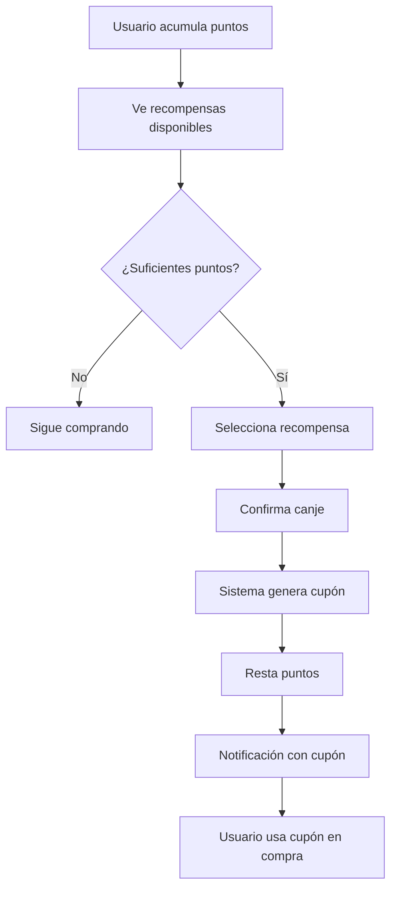
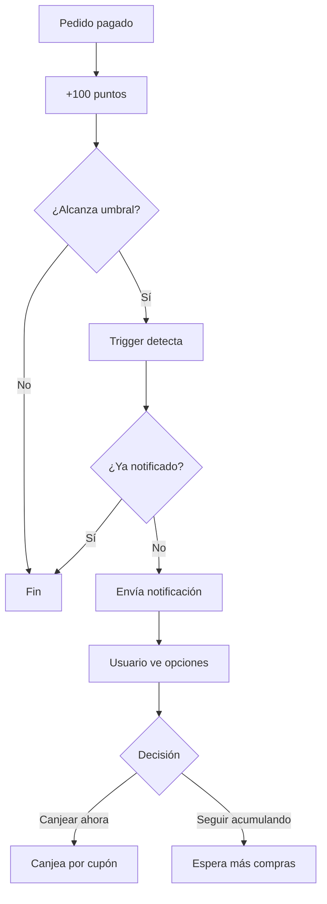
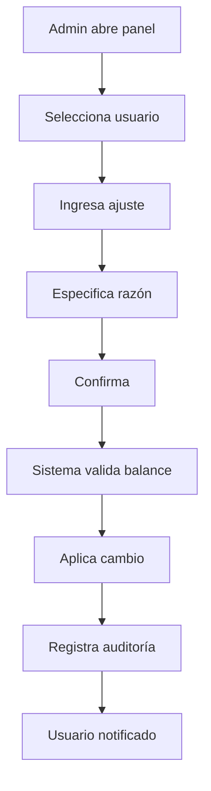

# 🎁 SISTEMA DE LEALTAD COMPLETO Y ROBUSTO

## 📋 Descripción General

Sistema avanzado de lealtad con gestión manual de puntos, canjes automáticos de recompensas y notificaciones inteligentes.

---

## ✨ Nuevas Características

### 1. Gestión Manual de Puntos por Admin

**Funcionalidad:**
- ✅ Añadir puntos a usuarios específicos
- ✅ Restar puntos de usuarios
- ✅ Editar balance manualmente
- ✅ Registro completo de auditoría
- ✅ Prevención de balance negativo

**Casos de uso:**
- Compensación por problemas
- Promociones especiales
- Corrección de errores
- Bonos por referidos
- Penalizaciones

**Función SQL:**
```sql
SELECT adjust_loyalty_points_manual(
  'user-uuid',      -- ID del usuario
  100,              -- Puntos (positivo añade, negativo resta)
  'Compensación',   -- Razón del ajuste
  'admin-uuid'      -- ID del admin que hace el ajuste
);
```

### 2. Sistema de Canje de Recompensas

**Funcionamiento:**
1. Usuario acumula puntos
2. Alcanza umbral de recompensa
3. Recibe notificación automática
4. Puede canjear o seguir acumulando
5. Al canjear, recibe cupón único
6. Cupón válido por 30 días

**Proceso automático:**
```
Puntos ganados → Trigger detecta umbral → Notificación enviada
                                              ↓
                                    Usuario decide canjear
                                              ↓
                                    Genera cupón automático
                                              ↓
                                    Resta puntos del balance
```

**Función SQL:**
```sql
SELECT redeem_loyalty_reward(
  'user-uuid',    -- ID del usuario
  'reward-uuid'   -- ID de la recompensa
);
-- Retorna: Código de cupón generado
```

### 3. Notificaciones Automáticas Inteligentes

**Lógica:**
- Detecta cuando usuario alcanza nuevo umbral
- Notifica solo la primera vez (no spam)
- Sugiere opción de canjear O seguir acumulando
- No re-notifica en 7 días

**Ejemplo de notificación:**
```
🎉 ¡Nueva Recompensa Disponible!
Tienes 150 puntos. Puedes canjear:
- Descuento 10% (100 puntos)
O seguir acumulando para:
- Descuento 20% (200 puntos)
```

---

## 🗄️ Nuevas Tablas

### `loyalty_redemptions`
Registro de todos los canjes de recompensas.

```sql
CREATE TABLE loyalty_redemptions (
  id uuid PRIMARY KEY,
  user_id uuid NOT NULL,
  reward_id uuid NOT NULL,
  points_spent integer NOT NULL,
  coupon_code text,
  status text NOT NULL DEFAULT 'active', -- active, used, expired
  created_at timestamptz NOT NULL,
  used_at timestamptz,
  expires_at timestamptz
);
```

**Estados:**
- `active`: Cupón generado, disponible para usar
- `used`: Cupón ya utilizado
- `expired`: Cupón expiró sin usar

### `loyalty_adjustments`
Auditoría de ajustes manuales de puntos.

```sql
CREATE TABLE loyalty_adjustments (
  id uuid PRIMARY KEY,
  user_id uuid NOT NULL,
  points_change integer NOT NULL,  -- +/- puntos
  reason text NOT NULL,
  admin_id uuid,
  created_at timestamptz NOT NULL
);
```

**Ejemplo de registros:**
| Usuario | Cambio | Razón | Admin | Fecha |
|---------|--------|-------|-------|-------|
| Juan | +100 | Compensación por retraso | Admin1 | 2025-11-05 |
| María | -50 | Corrección de error | Admin2 | 2025-11-05 |
| Pedro | +200 | Bono especial | Admin1 | 2025-11-05 |

---

## 🔧 Funciones Principales

### 1. `adjust_loyalty_points_manual()`

**Propósito:** Ajustar puntos manualmente con auditoría completa.

**Parámetros:**
- `p_user_id`: UUID del usuario
- `p_points_change`: Cambio de puntos (positivo o negativo)
- `p_reason`: Razón del ajuste
- `p_admin_id`: UUID del administrador

**Características:**
- Previene balance negativo
- Actualiza `lifetime_points` solo si suma
- Registra en tabla de auditoría
- Genera log para debugging

**Ejemplo de uso:**
```sql
-- Añadir 150 puntos
CALL adjust_loyalty_points_manual(
  'a1b2c3d4-...',
  150,
  'Bono por referir 3 amigos',
  'admin-uuid'
);

-- Restar 50 puntos
CALL adjust_loyalty_points_manual(
  'a1b2c3d4-...',
  -50,
  'Corrección: puntos duplicados',
  'admin-uuid'
);
```

### 2. `redeem_loyalty_reward()`

**Propósito:** Canjear puntos por recompensa y generar cupón.

**Parámetros:**
- `p_user_id`: UUID del usuario
- `p_reward_id`: UUID de la recompensa

**Retorna:** Código del cupón generado (text)

**Proceso:**
1. Valida que recompensa existe y está activa
2. Verifica que usuario tiene suficientes puntos
3. Genera código único: `LOYALTY-XXXXXXXX`
4. Crea cupón en tabla `coupons`
5. Resta puntos del usuario
6. Registra canje en `loyalty_redemptions`
7. Envía notificación al usuario

**Ejemplo:**
```sql
-- Canjear 100 puntos por descuento
SELECT redeem_loyalty_reward(
  'user-uuid',
  'reward-uuid'
);
-- Retorna: 'LOYALTY-A1B2C3D4'
```

**Validaciones:**
- ❌ Recompensa no existe → Error
- ❌ Recompensa inactiva → Error
- ❌ Puntos insuficientes → Error
- ✅ Todo correcto → Genera cupón

### 3. `notify_available_rewards()`

**Propósito:** Notificar automáticamente sobre recompensas alcanzables.

**Trigger:** Se ejecuta AFTER UPDATE en `loyalty_points`

**Lógica:**
```
1. ¿Aumentaron los puntos?
   NO → Salir
   SÍ → Continuar

2. ¿Hay recompensas alcanzables nuevas?
   NO → Salir
   SÍ → Continuar

3. ¿Ya se notificó en últimos 7 días?
   SÍ → Salir (evitar spam)
   NO → Enviar notificación
```

**Anti-spam:**
- Solo notifica cuando cruza nuevo umbral
- No re-notifica la misma recompensa en 7 días
- Una notificación por cambio de puntos

---

## 🎯 Flujos de Usuario

### Flujo 1: Canje Manual por Usuario



### Flujo 2: Notificación Automática



### Flujo 3: Ajuste Manual por Admin



---

## 📊 Ejemplos de Configuración

### Estructura de Recompensas Recomendada

| Nivel | Puntos | Recompensa | Tipo | Valor |
|-------|--------|------------|------|-------|
| 🥉 Bronce | 100 | Descuento básico | percentage | 5% |
| 🥈 Plata | 250 | Descuento medio | percentage | 10% |
| 🥇 Oro | 500 | Descuento premium | percentage | 15% |
| 💎 Platino | 1000 | Descuento VIP | percentage | 20% |
| 🌟 Diamante | 2000 | Envío gratis | fixed | €10 |

**SQL para crear:**
```sql
INSERT INTO loyalty_rewards (name, points_required, reward_type, reward_value) VALUES
  ('Descuento Bronce 5%', 100, 'percentage', 5),
  ('Descuento Plata 10%', 250, 'percentage', 10),
  ('Descuento Oro 15%', 500, 'percentage', 15),
  ('Descuento Platino 20%', 1000, 'percentage', 20),
  ('Envío Gratis', 2000, 'fixed', 10);
```

### Escenario Completo de Usuario

**Usuario: María**
```
Día 1:  Compra €100 → +100 puntos (Total: 100)
        🔔 "Puedes canjear: Bronce 5% o seguir para Plata 10%"
        
Día 5:  Compra €80 → +80 puntos (Total: 180)
        (Sin notificación, no alcanzó nuevo umbral)
        
Día 10: Compra €100 → +100 puntos (Total: 280)
        🔔 "¡Alcanzaste Plata! Puedes canjear 10% o seguir para Oro 15%"
        
Día 12: Canjea Plata 10% → -250 puntos (Total: 30)
        🎁 Recibe: LOYALTY-ABC12345
        Cupón válido 30 días
        
Día 15: Usa cupón en compra de €200
        Descuento: €20
        Puntos por compra: +200
        Total puntos: 230
```

---

## 🛠️ Panel de Administración

### Sección: Gestión de Puntos

**Funcionalidades:**
1. **Lista de usuarios con puntos**
   - Ordenar por balance, lifetime, última actividad
   - Buscar por nombre/email
   - Ver historial completo

2. **Ajustar puntos**
   - Formulario: Usuario, Cantidad (+/-), Razón
   - Validación en tiempo real
   - Confirmación antes de aplicar

3. **Historial de ajustes**
   - Tabla con todos los cambios manuales
   - Filtros: Usuario, Admin, Fecha, Tipo
   - Exportar a CSV

### Sección: Recompensas

**Funcionalidades:**
1. **Crear/Editar recompensas**
   - Nombre
   - Puntos requeridos
   - Tipo (percentage, fixed)
   - Valor del descuento

2. **Ver canjes**
   - Lista de todos los canjes
   - Estado: Activo, Usado, Expirado
   - Cupones generados
   - Fecha de uso/expiración

3. **Estadísticas**
   - Recompensas más canjeadas
   - Puntos totales en circulación
   - Tasa de canje
   - Cupones activos vs usados

---

## 🔐 Seguridad y Permisos

### RLS Policies

**`loyalty_redemptions`:**
```sql
-- Usuarios ven solo sus propios canjes
CREATE POLICY "Users can view own redemptions"
ON loyalty_redemptions FOR SELECT
USING (auth.uid() = user_id);

-- Admins ven y gestionan todos
CREATE POLICY "Admins can manage redemptions"
ON loyalty_redemptions FOR ALL
USING (has_role(auth.uid(), 'admin'));
```

**`loyalty_adjustments`:**
```sql
-- Solo admins pueden ver ajustes
CREATE POLICY "Admins can view adjustments"
ON loyalty_adjustments FOR SELECT
USING (has_role(auth.uid(), 'admin'));

-- Solo admins pueden crear ajustes
CREATE POLICY "Admins can create adjustments"
ON loyalty_adjustments FOR INSERT
WITH CHECK (has_role(auth.uid(), 'admin'));
```

### Validaciones

**Prevención de fraude:**
- Balance nunca puede ser negativo
- Cupones de un solo uso
- Expiración automática en 30 días
- Auditoría completa de todos los cambios

**Límites recomendados:**
- Máximo ajuste manual: ±5000 puntos por vez
- Máximo canjes por día: 3 por usuario
- Mínimo entre canjes: 1 hora

---

## 📈 Monitoreo y Analytics

### Consultas Útiles

**Ver usuarios más activos:**
```sql
SELECT 
  p.email,
  lp.points_balance as puntos_actuales,
  lp.lifetime_points as puntos_historicos,
  COUNT(lr.id) as canjes_totales
FROM loyalty_points lp
JOIN profiles p ON p.id = lp.user_id
LEFT JOIN loyalty_redemptions lr ON lr.user_id = lp.user_id
GROUP BY p.email, lp.points_balance, lp.lifetime_points
ORDER BY lp.lifetime_points DESC
LIMIT 20;
```

**Recompensas más populares:**
```sql
SELECT 
  lrw.name,
  lrw.points_required,
  COUNT(lr.id) as veces_canjeada,
  SUM(lr.points_spent) as puntos_totales
FROM loyalty_rewards lrw
LEFT JOIN loyalty_redemptions lr ON lr.reward_id = lrw.id
GROUP BY lrw.name, lrw.points_required
ORDER BY veces_canjeada DESC;
```

**Auditoría de ajustes:**
```sql
SELECT 
  p.email as usuario,
  la.points_change,
  la.reason,
  a.email as admin,
  la.created_at
FROM loyalty_adjustments la
JOIN profiles p ON p.id = la.user_id
LEFT JOIN profiles a ON a.id = la.admin_id
ORDER BY la.created_at DESC
LIMIT 50;
```

---

## ✅ Checklist de Implementación

### Backend (Completado)
- [x] Tabla `loyalty_redemptions`
- [x] Tabla `loyalty_adjustments`
- [x] Función `adjust_loyalty_points_manual()`
- [x] Función `redeem_loyalty_reward()`
- [x] Función `notify_available_rewards()`
- [x] Trigger automático de notificaciones
- [x] Políticas RLS
- [x] Índices de performance

### Frontend (Pendiente)
- [ ] Panel admin: Gestión de puntos
- [ ] Panel admin: Historial de ajustes
- [ ] Panel admin: Estadísticas de canjes
- [ ] Panel usuario: Ver recompensas disponibles
- [ ] Panel usuario: Canjear recompensas
- [ ] Panel usuario: Historial de canjes
- [ ] Notificaciones en tiempo real

---

## 🚀 Próximos Pasos

1. **Actualizar interfaz de admin** para gestión manual
2. **Crear panel de usuario** para canjes
3. **Implementar notificaciones push** en tiempo real
4. **Dashboard de analytics** con gráficos
5. **Email automático** cuando se alcanza umbral

---

**Estado:** ✅ BACKEND COMPLETADO  
**Fecha:** 5 de Noviembre 2025  
**Versión:** 2.0.0
