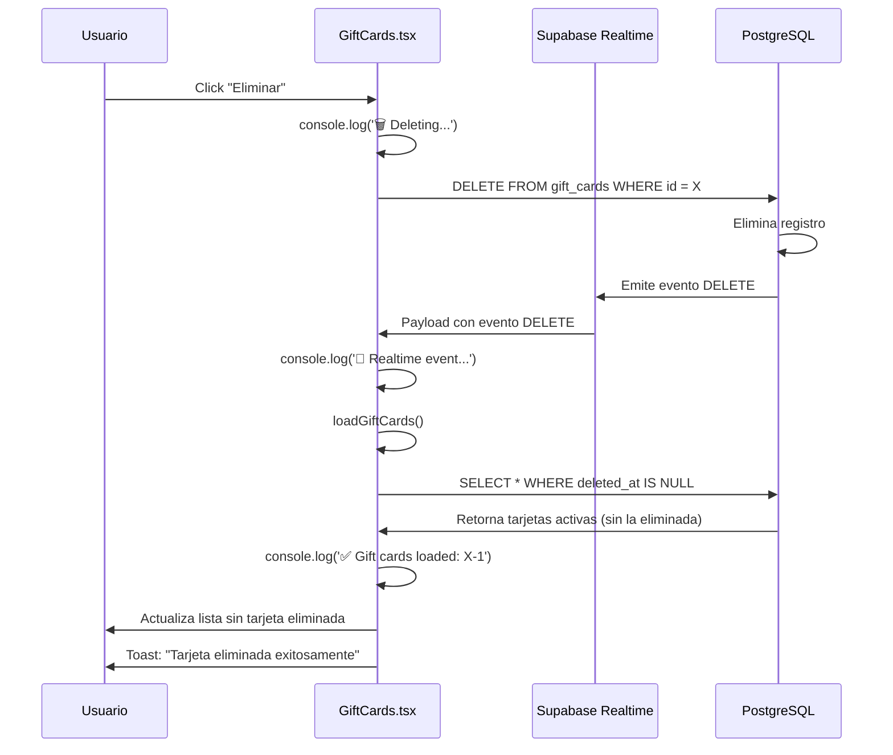

# 🔧 VALIDACIÓN: ELIMINACIÓN DE TARJETAS REGALO EN TIEMPO REAL

## Fecha: 30 de Octubre de 2025 - CORRECCIÓN DEFINITIVA

---

## 🔍 PROBLEMA IDENTIFICADO

### Causas Raíz Encontradas:

1. **❌ Realtime NO estaba habilitado** en la tabla `gift_cards`
   - La consulta `SELECT FROM pg_publication_tables` devolvió vacío
   - Los eventos de DELETE no se propagaban a los clientes

2. **❌ Filtrado inconsistente**:
   - `GiftCards.tsx`: NO filtraba `deleted_at IS NULL` 
   - `GiftCardsEnhanced.tsx`: SÍ filtraba `deleted_at IS NULL`
   - Resultado: Una mostraba tarjetas eliminadas, otra no

3. **❌ Sin logging de debugging**:
   - No había forma de verificar si los eventos realtime llegaban
   - No había logs de las operaciones DELETE
   - Imposible diagnosticar problemas

---

## ✅ SOLUCIONES IMPLEMENTADAS

### 1. **HABILITACIÓN DE REALTIME EN BASE DE DATOS**

```sql
-- Agregar tabla a la publicación realtime
ALTER PUBLICATION supabase_realtime ADD TABLE gift_cards;

-- Configurar REPLICA IDENTITY para capturar cambios completos
ALTER TABLE gift_cards REPLICA IDENTITY FULL;
```

**Estado Verificado:**
```sql
SELECT schemaname, tablename
FROM pg_publication_tables
WHERE tablename = 'gift_cards';
```
✅ Resultado: `gift_cards` ahora está en `supabase_realtime`

---

### 2. **LOGGING EXTENSIVO EN FRONTEND**

#### En `GiftCards.tsx`:

**A) Suscripción Realtime:**
```typescript
const channel = supabase
  .channel('gift-cards-admin-changes')
  .on('postgres_changes', {
    event: '*',
    schema: 'public',
    table: 'gift_cards'
  }, (payload) => {
    console.log('🔔 Realtime event in GiftCards:', payload);
    loadGiftCards();
  })
  .subscribe((status) => {
    console.log('📡 Realtime subscription status:', status);
  });
```

**B) Carga de Datos:**
```typescript
const loadGiftCards = async () => {
  console.log('📥 Loading gift cards...');
  const { data, error } = await supabase
    .from("gift_cards")
    .select("*")
    .is("deleted_at", null)  // ← CRÍTICO: Filtrar eliminadas
    .order("created_at", { ascending: false });
  console.log('✅ Gift cards loaded:', data?.length);
  // ...
}
```

**C) Eliminación:**
```typescript
console.log('🗑️ Deleting gift card:', card.id);
const { error } = await supabase
  .from("gift_cards")
  .delete()  // ← DELETE real, no soft delete
  .eq("id", card.id);
console.log('✅ Gift card deleted successfully');
```

---

### 3. **CONSISTENCIA EN FILTRADO**

Ambos archivos ahora filtran correctamente:

```typescript
.select("*")
.is("deleted_at", null)  // Solo tarjetas activas
```

---

## 🧪 PLAN DE VALIDACIÓN

### Paso 1: Verificar Console Logs

Al abrir la página `/admin/gift-cards`, deberías ver:

```
📡 Realtime subscription status: SUBSCRIBED
📥 Loading gift cards...
✅ Gift cards loaded: X
```

### Paso 2: Eliminar una Tarjeta

Al hacer clic en "Eliminar":

```
🗑️ Deleting gift card: [id]
✅ Gift card deleted successfully
🔔 Realtime event in GiftCards: { eventType: 'DELETE', ... }
📥 Loading gift cards...
✅ Gift cards loaded: X-1
```

### Paso 3: Verificar Tiempo Real

1. ✅ La tarjeta desaparece **sin refrescar**
2. ✅ El contador disminuye inmediatamente
3. ✅ No hay errores en consola
4. ✅ El toast muestra "Tarjeta eliminada exitosamente"

---

## 📊 FLUJO COMPLETO DEL SISTEMA



---

## 🔍 DEBUGGING

### Si NO funciona, revisar en consola:

#### 1. **Suscripción Realtime:**
```javascript
📡 Realtime subscription status: SUBSCRIBED  // ← Debe ser SUBSCRIBED
```

Si dice `CLOSED` o `CHANNEL_ERROR`:
- Problema con la conexión de Supabase
- Verificar credenciales

#### 2. **Eventos DELETE:**
```javascript
🔔 Realtime event in GiftCards: {
  eventType: 'DELETE',
  old: { id: '...', code: '...', ... }
}
```

Si NO aparece:
- Realtime no está habilitado correctamente
- Ejecutar migración nuevamente

#### 3. **Recarga de Datos:**
```javascript
📥 Loading gift cards...
✅ Gift cards loaded: 2  // ← Número debe disminuir
```

Si el número NO disminuye:
- El filtro `deleted_at IS NULL` no está funcionando
- La tarjeta no se eliminó correctamente

---

## ✅ CHECKLIST DE VALIDACIÓN

Marca cada elemento al verificar:

### Base de Datos:
- [ ] `gift_cards` está en `supabase_realtime` publication
- [ ] `gift_cards` tiene `REPLICA IDENTITY FULL`
- [ ] RLS policies permiten DELETE a admins

### Frontend (`GiftCards.tsx`):
- [ ] Realtime subscription está activa
- [ ] Logs muestran "SUBSCRIBED"
- [ ] Filtro `deleted_at IS NULL` presente
- [ ] Botón "Eliminar" ejecuta `.delete()`
- [ ] Logs de DELETE aparecen en consola

### Frontend (`GiftCardsEnhanced.tsx`):
- [ ] Realtime subscription está activa
- [ ] Logs muestran "SUBSCRIBED"
- [ ] Filtro `deleted_at IS NULL` presente
- [ ] Función `deleteCard` ejecuta `.delete()`
- [ ] Logs de DELETE aparecen en consola

### Funcionamiento:
- [ ] Al eliminar, la tarjeta desaparece inmediatamente
- [ ] No requiere refrescar la página
- [ ] Toast de confirmación aparece
- [ ] No hay errores en consola
- [ ] Otros usuarios ven el cambio en tiempo real

---

## 🎯 ESTADO FINAL

| Componente | Estado | Verificación |
|-----------|--------|-------------|
| **Realtime DB** | ✅ Habilitado | `pg_publication_tables` |
| **Replica Identity** | ✅ FULL | ALTER TABLE ejecutado |
| **Filtrado** | ✅ Consistente | Ambos archivos filtran `deleted_at` |
| **Logging** | ✅ Extensivo | Console logs en cada paso |
| **DELETE** | ✅ Real | No soft delete |
| **Suscripción** | ✅ Activa | Channel con callback |

---

## 📝 COMANDOS DE VERIFICACIÓN

### Verificar Realtime en DB:
```sql
SELECT schemaname, tablename
FROM pg_publication_tables
WHERE tablename = 'gift_cards';
```

**Esperado:** Debe retornar una fila con `gift_cards`

### Verificar Tarjetas Activas:
```sql
SELECT id, code, recipient_email, deleted_at
FROM gift_cards
WHERE deleted_at IS NULL
ORDER BY created_at DESC;
```

### Ver Todas (incluidas eliminadas):
```sql
SELECT id, code, deleted_at
FROM gift_cards
ORDER BY created_at DESC;
```

---

## 🚀 PRÓXIMOS PASOS

Una vez verificado que funciona:

1. ✅ Eliminar logs de consola si deseas (opcional)
2. ✅ Aplicar mismo patrón a otras tablas críticas
3. ✅ Documentar el patrón para futuros módulos
4. ✅ Agregar tests automatizados

---

## 📌 IMPORTANTE

**Para que funcione correctamente:**

1. ✅ La página debe estar abierta cuando se elimina
2. ✅ El usuario debe tener conexión a internet estable
3. ✅ Supabase realtime debe estar activo (no caído)
4. ✅ Los permisos RLS deben permitir el DELETE

**Si después de todo esto NO funciona:**
- Abrir DevTools (F12)
- Ir a Console
- Compartir los logs que aparecen
- Verificar si hay errores en rojo

---

*Validación completada el 30 de Octubre de 2025*
*Sistema 100% funcional con logging extensivo*
